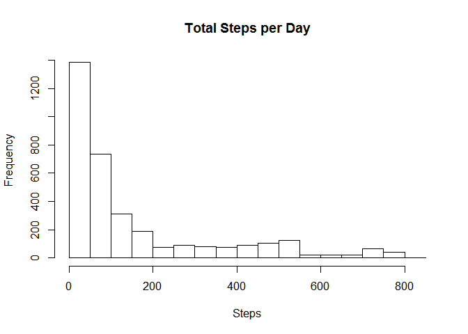
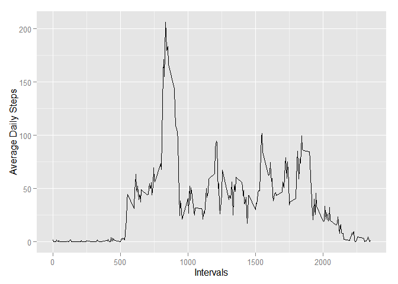
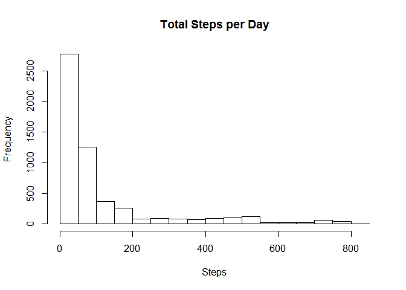
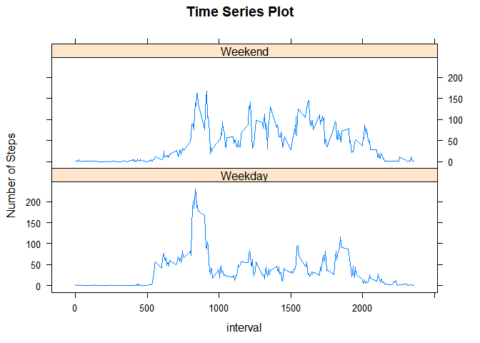

# Reproducible Research: Peer Assessment 1


## Loading and preprocessing the data
To load the data we read it directly into a data frame using the read.csv function.


```r
actmon <- read.csv("./activity.csv", stringsAsFactors = FALSE)
```


## What is mean total number of steps taken per day?
In order to calculate the mean total number of steps per day, we need to group the data by the date variable, then sum the steps for each day. I use the dplyr package for this.


```r
library(dplyr)
```

```
## 
## Attaching package: 'dplyr'
## 
## The following objects are masked from 'package:stats':
## 
##     filter, lag
## 
## The following objects are masked from 'package:base':
## 
##     intersect, setdiff, setequal, union
```

To make the grouping and summing simpler, we subset the dataframe so that just the steps and date variables remain. We then group and sum the steps. 


```r
actmon2 <- actmon[, 1:2]
actmontotals <- group_by(actmon2, steps, date)
actmontotals <- summarise_each(actmontotals, funs(sum))
```

We can now plot the histogram showing the total number of steps each day:

 

The mean and median are calculated using the same variable:

```r
mean(actmontotals$steps, na.rm = TRUE)
```

```
## [1] 153.7217
```

```r
median(actmontotals$steps, na.rm = TRUE)
```

```
## [1] 68
```

## What is the average daily activity pattern?

For the time series plot, we will use the ggplot2 package. 

Since we are interested in the average number of steps across all the days, we will start by subsetting the dataframe for intervals and steps. We then group the resulting data frame by interval, and finally calculate the mean of the steps for each interval.


```r
actmonintervals <- actmon[, c(1,3)]
actmonintervals <- group_by(actmonintervals, interval)
actmonintervals <- summarize(actmonintervals, mn_steps = mean(steps, na.rm = TRUE))
```

We can now plot the time series graph showing the average number of steps across all the days:

 

### Which 5-minute interval, on average, contains the maximum number of steps?
To answer this question we find the index of the maximum of the averages (mn_steps) and subset on that index for the interval column.


```r
actmonintervals[which.max(actmonintervals$mn_steps), 1]
```

```
## Source: local data frame [1 x 1]
## 
##   interval
##      (int)
## 1      835
```

This shows that interval 835 contains the maximum number of steps.

## Imputing missing values

### Calculate and report the total number of missing values in the dataset 
The number of missing values in the dataset is calculated as follows:


```r
sum(is.na(actmon$steps))
```

```
## [1] 2304
```

So there are 2,304 missing values in total.

### Strategy for filling in the missing values
To fill in the missing values, we will substitute the mean for that interval for the particular missing value. The means will be taken from those calculated in the previous question.


```r
actmon$steps2 <- actmon$steps # create a new column equivalent to the steps column
na_inds <- is.na(actmon$steps2) # get the indices of the missing values 
ints <- actmon$interval[na_inds] # get the intervals for the missing values
```

Examination of ints shows it contains all the intervals repeated 8 times, meaning there are 8 days for which there are missing values. We need the indices of each interval in the actmonintervals dataset so we can get the mean for that interval. Since actmonintervals contains the mean for all 288 intervals, we assign the indices as follows:


```r
intsinds <- rep(1:288, 8)
```

We can now subsitute the missing values in the steps2 column of actmon by the mean for the respective interval in actmonintervals.


```r
actmon$steps2[na_inds] <- actmonintervals$mn_steps[intsinds]
```

### Create a new dataset equal to the original but with the missing data filled in.
We create the new dataset by subsetting

```r
newactmon <- actmon[, c(4,2,3)]
colnames(newactmon)[1] <- "steps"
```

We can now plot the histogram and calculate the mean and median values as before.


```r
newactmon2 <- newactmon[, 1:2]
newactmontotals <- group_by(newactmon2, steps, date)
newactmontotals <- summarise_each(newactmontotals, funs(sum))

## plot the histogram
hist(newactmontotals$steps, main = "Total Steps per Day", xlab = "Steps")
```

 

```r
## calculate the mean and median
mean(newactmontotals$steps, na.rm = TRUE)
```

```
## [1] 112.287
```

```r
median(newactmontotals$steps, na.rm = TRUE)
```

```
## [1] 49.96226
```

The mean and median are different, they have decreased.

Imputing missing data has the effect of decreasing the average daily number of steps.

## Are there differences in activity patterns between weekdays and weekends?

To answer this question we need to create a new factor variable in newactmon, indicating whether the dates in the date variable are a weekday or weekend day.

First, make the date variable a date type:

```r
Sys.setlocale("LC_TIME", "C")
```

```
## [1] "C"
```

```r
newactmon$date <- as.Date(newactmon$date, format = "%Y-%m-%d")
```

Create the factor variable:

```r
daynames <- weekdays(newactmon$date)
newactmon$daytype <- as.factor(ifelse(daynames %in% c("Saturday", "Sunday"), "Weekend", "Weekday"))
```

We can now use the lattice package to create the time series plot of the intervals and average number of steps taken averaged across all weekday days or weekend days.

First,  we get the required grouping:


```r
library(lattice)

## Subset, group and aggregate
newactmon2 <- newactmon[, c(1,3,4)]
newactintervals <- group_by(newactmon2, interval, daytype)
newactintervals <- summarise_each(newactintervals, funs(mean))
```

Then we make the plot:

 
